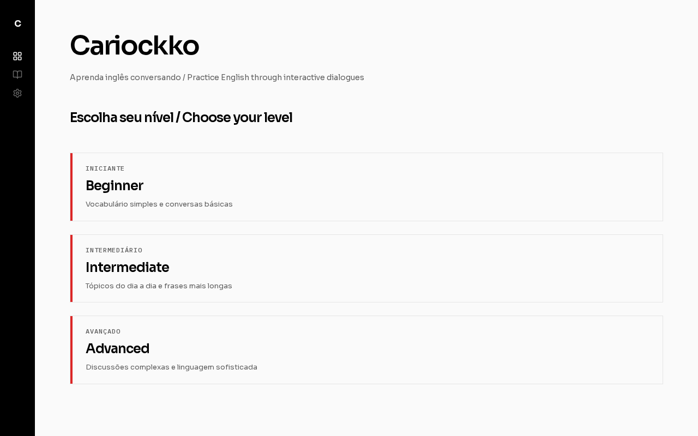
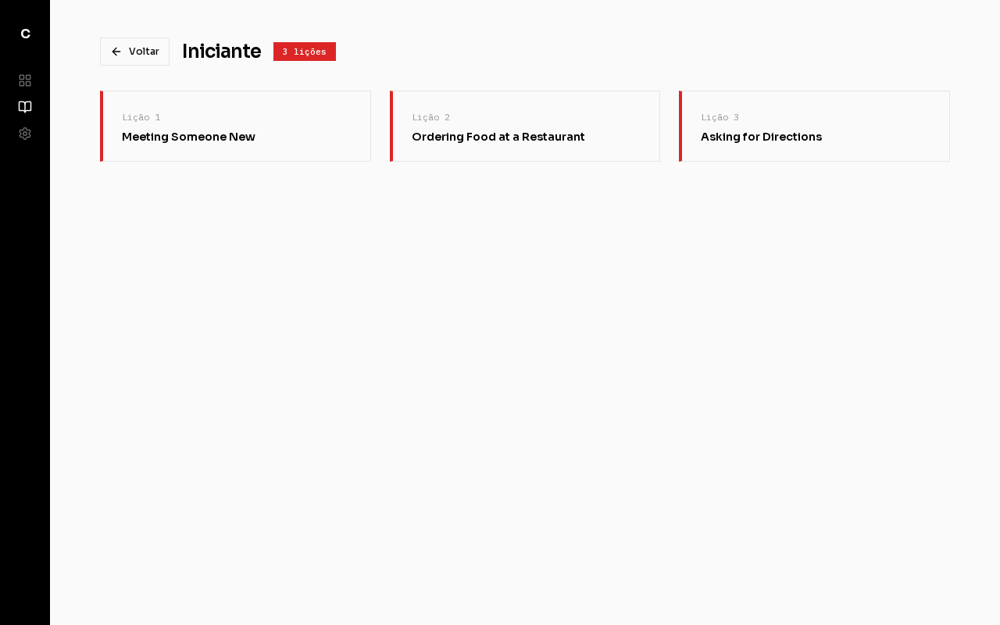
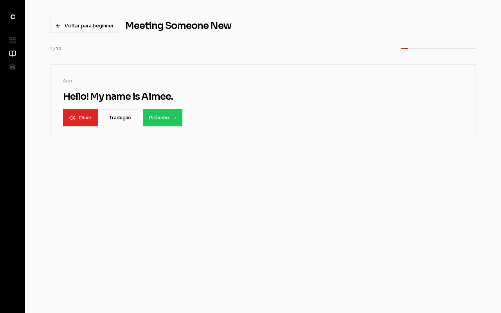

# Cariockko

**Learn English by talking** — An open-source English language-learning app designed for the Brazilian community.

Cariockko gives you a safe, judgment-free environment to practice listening and speaking English through interactive, AI-powered role-play conversations.

## Why Cariockko?

- Only ~5% of Brazilians have any knowledge of English, with less than 1–5% considered fluent
- Many face stigma and judgment from peers while learning
- International platforms assume basic English knowledge that most Brazilians don't have
- Tailored courses are often prohibitively expensive

Cariockko solves this by providing an accessible, private space where students practice at their own level with instant AI feedback in Brazilian Portuguese.

## How It Works

Each lesson is a scripted dialogue between two characters. You play one character; the app plays the other.

```
1. App presents a line  →  "So Todd, where are you from?"
2. You review            →  View translation, listen to audio
3. You respond           →  Record your line
4. AI analyzes           →  Speaking Tutor evaluates your audio
5. Feedback delivered    →  Summary in Brazilian Portuguese
   ✅ Correct → Proceed to next exchange
   ❌ Incorrect → Retry until successful
```

## Screenshots

After running `make start` and opening `http://localhost:3000`, you'll see:

### 1. Home Page — Level Selection

Choose between Beginner, Intermediate, and Advanced difficulty levels:



### 2. Lessons List

Each level contains 3 AI-generated lessons:



### 3. Lesson Player

Interactive dialogue with audio playback, translation, and voice recording:



## Features

- **Three difficulty levels** — Beginner, Intermediate, and Advanced (3 lessons each, 9 total)
- **AI Content Generation** — Lessons are generated by a Content Producer Agent using GPT-4o-mini
- **Speaking Analysis & Feedback** — A Speaking Tutor Agent transcribes audio via Whisper and evaluates pronunciation/vocabulary
- **AI-Generated Audio** — All listening clips use OpenAI text-to-speech
- **Translation Support** — Brazilian Portuguese translation available for every dialogue line
- **No account required** — Start practicing immediately
- **Progress tracking** — Lesson completion tracked via local session

## Quick Start

### Prerequisites

- [Docker](https://docs.docker.com/get-docker/) and Docker Compose
- [OpenAI API key](https://platform.openai.com/api-keys)

### Setup

```bash
# 1. Clone the repository
git clone https://github.com/araujgom/cariockko.git
cd cariockko

# 2. Configure environment
cp .env.example .env
# Edit .env and add your OPENAI_API_KEY

# 3. Start all services
make start
# or: docker compose up -d --build

# 4. Open http://localhost:3000 in your browser
```

The first startup takes 2–5 minutes while the API seeds 9 lessons with AI-generated content and audio.

### Verify Services

```bash
# Check all services are running
make status
# or: docker compose ps

# Check API health (waits for lesson seeding)
curl http://localhost:3001/health/ready
```

## Make Commands

| Command | Description |
|---------|-------------|
| `make start` | Start all services (detached, with builds) |
| `make stop` | Stop all services (keep volumes) |
| `make destroy` | Stop all services and remove volumes (deletes all data) |
| `make restart` | Restart all services |
| `make logs` | Follow logs from all services |
| `make status` | Show status of all services |
| `make help` | Show available commands |

## Architecture

```
┌─────────────────────────────────────────────────────────────┐
│                     Docker Compose                          │
├─────────────────────────────────────────────────────────────┤
│                                                             │
│  ┌──────────────┐    ┌──────────────┐    ┌──────────────┐  │
│  │  web (:3000) │───▶│  api (:3001) │───▶│  db (:5432)  │  │
│  │   Next.js    │    │   Express    │    │  PostgreSQL  │  │
│  └──────────────┘    └──────┬───────┘    └──────────────┘  │
│                             │                               │
│                             ▼                               │
│                     ┌──────────────┐                        │
│                     │ minio (:9000)│                        │
│                     │  S3 Storage  │                        │
│                     └──────────────┘                        │
│                                                             │
├─────────────────────────────────────────────────────────────┤
│                     External Services                       │
│                                                             │
│  OpenAI API ──────────────────────────────────────────────  │
│  ├─ GPT-4o-mini (content generation, speech evaluation)    │
│  ├─ Whisper-1 (speech-to-text transcription)               │
│  └─ TTS-1 (text-to-speech audio generation)                │
└─────────────────────────────────────────────────────────────┘
```

### Components

| Service | Technology | Port | Purpose |
|---------|-----------|------|---------|
| `web` | Next.js 15 + React 19 + Tailwind CSS 4 | 3000 | Frontend UI |
| `api` | Express + LangChain + OpenAI | 3001 | Backend API & AI agents |
| `db` | PostgreSQL 15 | 5432 | Data storage |
| `minio` | MinIO (S3-compatible) | 9000/9001 | Audio file storage |

## API Reference

### Health Checks

```
GET /health          → { "status": "ok" }
GET /health/ready    → { "status": "ready", "lessons": 9 }
                     → { "status": "seeding", "lessons": 3, "expected": 9 }
```

### Lessons

```
GET /api/lessons                    → List all lessons (optional: ?level=beginner)
GET /api/lessons/:id                → Get lesson with dialogue exchanges
```

**Response (list):**
```json
[
  {
    "id": "uuid",
    "title": "Meeting someone new",
    "level": "beginner",
    "created_at": "2025-01-01T00:00:00Z",
    "exchange_count": 10
  }
]
```

**Response (detail):**
```json
{
  "id": "uuid",
  "title": "Meeting someone new",
  "level": "beginner",
  "exchanges": [
    {
      "id": "uuid",
      "order_index": 0,
      "speaker": "app",
      "english_text": "Hello! My name is Aimee. What's your name?",
      "portuguese_translation": "Olá! Meu nome é Aimee. Qual é o seu nome?",
      "audio_url": "http://localhost:9000/audio/lessons/..."
    }
  ]
}
```

### Speaking Tutor

```
POST /api/speaking-tutor
Content-Type: multipart/form-data
```

| Field | Type | Required | Description |
|-------|------|----------|-------------|
| `audio` | File | Yes | Audio recording (webm, mp3, wav, ogg, max 10MB) |
| `lesson_id` | String | Yes | Lesson UUID |
| `exchange_index` | Number | Yes | Current dialogue exchange index |
| `expected_text` | String | Yes | The English text the student should say |

**Response:**
```json
{
  "is_correct": true,
  "feedback_pt": "Muito bem! Sua pronúncia está ótima.",
  "transcription": "Hello, my name is Todd"
}
```

### Progress

```
POST /api/progress                  → Save lesson completion
GET  /api/progress/:session_id      → Get completed lessons for session
```

**Request (POST):**
```json
{
  "session_id": "local-storage-session-id",
  "lesson_id": "uuid",
  "completed": true
}
```

## Database Schema

```sql
-- Lessons
lessons (id, title, level, created_at)
  level: 'beginner' | 'intermediate' | 'advanced'

-- Dialogue exchanges within lessons
dialogue_exchanges (id, lesson_id, order_index, speaker, english_text, portuguese_translation, audio_url, created_at)
  speaker: 'app' | 'student'

-- User progress tracking
user_progress (id, session_id, lesson_id, completed, completed_at, created_at)
  UNIQUE(session_id, lesson_id)
```

## Configuration

### Environment Variables

| Variable | Required | Default | Description |
|----------|----------|---------|-------------|
| `OPENAI_API_KEY` | Yes | — | OpenAI API key for AI features |
| `POSTGRES_DB` | No | `postgres` | PostgreSQL database name |
| `POSTGRES_PASSWORD` | No | `local-dev-password` | PostgreSQL password |
| `MINIO_ROOT_USER` | No | `minioadmin` | MinIO access key |
| `MINIO_ROOT_PASSWORD` | No | `minioadmin` | MinIO secret key |
| `NEXT_PUBLIC_API_URL` | No | `http://localhost:3001` | API URL (client-side) |
| `API_INTERNAL_URL` | No | `http://api:3001` | API URL (server-side, Docker) |

### AI Models

| Capability | Model | Purpose |
|-----------|-------|---------|
| Content Generation | `gpt-4o-mini` | Creates lesson dialogues |
| Speech Evaluation | `gpt-4o-mini` | Analyzes student recordings |
| Speech-to-Text | `whisper-1` | Transcribes audio |
| Text-to-Speech | `tts-1` (voice: nova) | Generates listening audio |

## Project Structure

```
cariockko/
├── api/                          # Backend API
│   ├── src/
│   │   ├── agents/
│   │   │   ├── content-producer.ts   # Lesson generation agent
│   │   │   └── speaking-tutor.ts     # Speech evaluation agent
│   │   ├── lib/
│   │   │   ├── db.ts                 # PostgreSQL connection
│   │   │   └── storage.ts            # MinIO/S3 client
│   │   ├── routes/
│   │   │   ├── lessons.ts            # Lesson endpoints
│   │   │   ├── progress.ts           # Progress tracking
│   │   │   └── speaking-tutor.ts     # Audio analysis
│   │   ├── scripts/
│   │   │   └── seed-lessons.ts       # Standalone seed script
│   │   ├── entrypoint.ts             # App startup + auto-seed
│   │   └── index.ts                  # Express server
│   ├── Dockerfile
│   └── package.json
├── web/                          # Frontend
│   ├── src/
│   │   ├── app/
│   │   │   ├── page.tsx              # Home (level selection)
│   │   │   ├── lessons/[level]/      # Lesson list by level
│   │   │   └── lesson/[id]/          # Lesson player
│   │   ├── components/
│   │   │   └── LessonPlayer.tsx      # Main lesson interaction
│   │   └── lib/
│   │       └── api.ts                # API client
│   ├── Dockerfile
│   └── package.json
├── db/                           # Database initialization
│   ├── init.sql                      # Schema
│   └── init.sh                       # Init script
├── docs/                         # Documentation
├── .product/
│   └── ideation.md               # Product vision & requirements
├── docker-compose.yml            # Service orchestration
├── Makefile                      # Development commands
├── .env.example                  # Environment template
└── README.md
```

## Development

### Running Locally (without Docker)

```bash
# Terminal 1: Start PostgreSQL and MinIO
docker compose up db minio minio-init

# Terminal 2: Start API
cd api
cp ../.env.example .env
npm install
npm run dev

# Terminal 3: Start Web
cd web
npm install
npm run dev
```

### Seeding Lessons

Lessons are automatically seeded on first API startup. To manually re-seed:

```bash
# Via Docker
docker compose run --rm api npm run seed-lessons

# Locally
cd api
npm run seed-lessons
```

## Contributing

Contributions are welcome! Please open an issue or submit a pull request.
